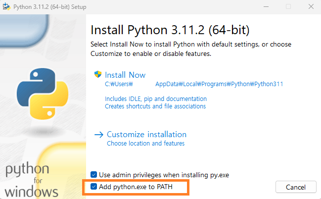

# PYTHON IN LOCAL

## Install Python in Local

https://www.python.org/ 에서 각자의 PC에 최신 Python 버전을 설치합니다.

윈도우에서는 설치 시 아래와 같이 "Add python.exe to PATH" 옵션을 활성화해줍니다.
<p style="text-align: center;">
</img>
</p>

PC의 터미널(윈도우의 경우 `cmd`, 맥의 경우 `terminal` 실행)에서 `python --version`을 입력했을 때 설치한 버전이 예컨대 `Python 3.11.2`와 같은 식으로 뜨면 잘 설치된 것입니다.


## Ways to use Python in Local

### (1) 대화식 인터프리터

Python은 스크립트 언어이기 때문에 굳이 하나의 파일을 통째로 실행시킬 필요가 없습니다. 하나의 런타임이 실행되는 동안 사용자가 원하는 만큼 한줄 한줄씩 코드를 입력하고 실행시켜도 되죠.

운영체제의 터미널을 사용해 한줄씩 파이썬 코드를 입력하고 실행시킬 수 있습니다. 참고로 터미널처럼 한줄씩 운영체제에 명령을 전달해 처리하는 시스템을 Command Line Interface(CLI)라고 부릅니다.

터미널에서 `python`을 입력하면, Python 코드를 입력할 수 있는 상태로 화면이 바뀝니다. 이 순간 하나의 python 런타임이 생성되었습니다. 한줄씩 Python 코드를 입력해 이 런타임과 직접 상호작용할 수 있습니다.

`print("Hello World")`를 입력하면, "Hello World"라는 문자열이 출력(print)됩니다.

`a=2`를 입력하면, 런타임 내에서 값 2를 갖는 변수 `a`가 선언됩니다. 별도의 출력 명령은 없기 때문에 상태창에 어떤 출력이 표시되지는 않습니다.
이제 `b=3`을 입력하고, 이어서 `print(a+b)`를 입력하면 `5`가 출력됩니다.

터미널에서 생성된 Python 런타임을 종료하고 싶다면 `exit()` 구문을 입력하면 됩니다. 런타임이 종료되고, 처음 터미널을 켰을 때의 화면으로 돌아갑니다.

우리는 방금 컴퓨터에 설치된 파이썬을 대화식 인터프리터 방식으로 사용했습니다. 만일 컴파일 언어였다면 이렇게 한줄씩 상호작용하는 식으로 사용할 수는 없었을 것입니다. 컴파일 언어로 작성된 파일을 런타임에서 실행시키려면 미리 파일 전체를 처음부터 끝까지 컴파일 해야하니까요.

### (2) 스크립트 파일 작성하고 실행하기

간단한 구문은 터미널에서 직접 실행할 수 있지만 큰 규모의 코드를 입력하기는 어렵습니다. 무엇보다 프로그램 코드는 보통 자동화되야 합니다: 즉 미리 만들어진 코드를 실행만 시키면 의도된대로 동작해야 합니다. 하지만 터미널에 한줄씩 직접 입력해서는 자동화할 수가 없죠.

Python을 사용하는 보다 일반적인 방법은 미리 Python 스크립트 파일을 작성하고, python 명령어를 통해 이 파일을 실행하는 것입니다. Python 파일은 보통 .py 확장자를 붙여줍니다.

한번 하나의 스크립트 파일을 작성하고 실행시켜 봅시다. 먼저 스크립트 파일을 저장할 임의의 폴더를 만듭니다. 그리고 다시 터미널을 열고 `cd` 명령어를 이용해 해당 폴더의 디렉토리로 이동합니다.

그리고 해당 폴더에 운영체제의 기본 텍스트 편집기를 이용해 임의의 .py 파일을 만들어 봅시다.

예컨대

```python
a = 2
b = 3
add = a+b
print(f"a+b={add}")
```
라는 코드를 [`add.py`](./demo1/add.py)라는 이름으로 저장해 보겠습니다.

이제 터미널에서 `python add.py`를 실행해보면, 터미널에 `a+b=5`라는 결과가 출력됩니다.

운영체제 내에서 하나의 python 런타임이 만들어지고, 그 런타임이 `add.py` 스크립트 파일을 읽고 실행시킨 것입니다. 실행이 종료되면 런타임도 종료됩니다. 이처럼 `python` + `(파일 이름)`을 입력하면 해당 파일에 적힌 파이썬 코드를 실행시킬 수 있습니다.

사실 방금 우리는 파일 하나짜리의 Python 프로그램을 만들고 이를 실행시킨 것입니다.

컴파일 언어라는 파일을 런타임에 실행시키기 전에 먼저 컴파일 하는 과정을 거쳐야 하지만, 우리 Python은 스크립트 언어이기 때문에 컴파일 과정 없이 바로 실행됩니다.

### (3) 주피터 노트북

주피터 노트북을 사용하는 일은 앞선 방법들에 비해 특수한 케이스입니다. 주피터 노트북이라는 하나의 프로그램을 별도로 설치한 후, 이 프로그램 안에서 파이썬을 이용하는 일이니까요.

주피터 노트북은 하나의 주피터 노트북 파일(보통 .ipynb 확장자로 끝나는)을 실행시키는 런타임을 만들고, 그 런타임 내에서 마치 대화식 인터프리터처럼 계속 구문을 추가하면서 작업할 수 있도록 지원해주는 하나의 프로그램입니다. 여러 데이터를 불러오고 조금씩 읽고 수정하면서 작업하기 매우 편리합니다.

역시 컴파일 언어가 아닌 스크립트 언어이기 때문에 가능한 일입니다.

노트북 파일을 닫거나 주피터 노트북 사용을 종료하면 런타임도 종료됩니다. 또 각각의 노트북 파일들은 서로 독립된 런타임을 같습니다.

로컬 PC에 주피터 노트북을 설치하고 사용하는 방법은 조금 뒤에 다시 살펴봅시다.

#### Colab

그럼 코랩은 무엇일까요? 코랩의 생김새나 작동방식은 주피터 노트북과 다를 바가 없습니다. 다만 코랩은 구글이 제공하는 네트워크 너머에 있는 원격 서버에서 주피터 노트북(같은 것)을 실행하는 방식입니다. 우리가 브라우저에서 코드를 입력하면, 코드 텍스트 데이터는 네트워크를 따라 (바다 건너?) 어딘가에서 실제 작동 중인 원격 서버의 파이썬 런타임에 전달되고, 여기서 실제로 코드가 실행된 후 결과값이 출력되면 다시 네트워크를 타고 우리가 사용하는 브라우저에 전달되어 화면에 표시됩니다.

네트워크를 통해 데이터가 오가기 때문에 로컬 PC에서 주피터 노트북을 사용할 때보다 속도가 느릴 수 있지만, 구글 드라이브에서 바로 사용할 수 있고 공유할 수 있다는 점이 장점이죠. 또 로컬 PC의 경우 운영체제에 따른 차이 등 PC 설정에 따라 신경써야 할 점이 있지만 코랩을 사용하면 그런 점이 없다는 것도 장점입니다. 참고로 Colab의 원격 서버가 사용하는 운영체제는 Linux 계열입니다. 코랩은 어느 정도 원격 서버 자체와도 상호작용할 수 있도록 지원하는데, 우리는 코랩을 통해 구글이 제공하는 하나의 리눅스 원격 서버를 사용하는 셈입니다.

인터넷을 연결하고 코랩을 사용하는 일은 magical 하지만, 그 모든 것이 어딘가에 실재하는 물리적 컴퓨터 공간에서 발생하고 있는 일임을 늘 명심합시다.


## File Relations

### Module & NameSpace

코랩에서 `__name__` 변수를 출력해보면 `__main__`이라는 값이 출력될 것입니다.

또 앞서 만들었던 `add.py`에 `print(__name__)` 코드를 추가한 후 [실행시켜봅시다.](./demo1/add.py)

역시 `__main__`이 출력될 것입니다.

하나의 파이썬 파일은 하나의 "모듈"을 이룹니다. 각각의 파일이 곧 각각의 모듈이라고 이해해도 좋습니다. 그리고 각각의 모듈은 자기만의 namespace를 가집니다. namespace라는 말이 조금 낯설 수도 있지만, 뭐, 각자 독립된 경계를 갖는 것이라고 직관적으로 생각하면 됩니다. 별도의 namespace는 별도의 변수명 체계를 가지고 있습니다. 같은 변수명이라도 서로 다른 namespace에서 선언된 것이라면 당연히 서로 상관 없는 변수입니다. 예컨대 `add1.py`에서 선언된 `a=10`과 `add2.py`에 선언된 `a=20` 사이에는 아무런 관련도 없습니다.


### Packages

## Practice
